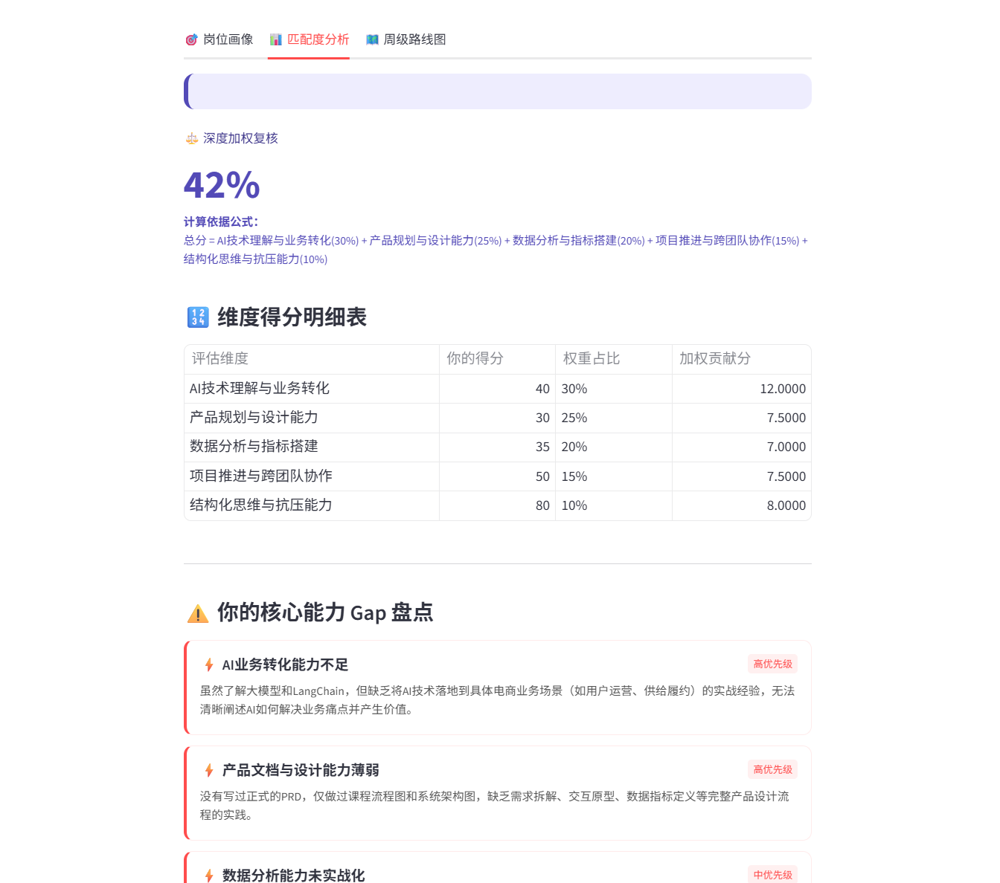
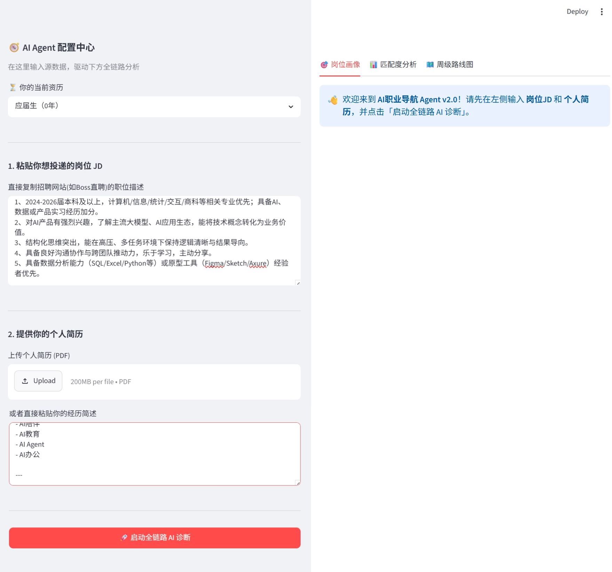
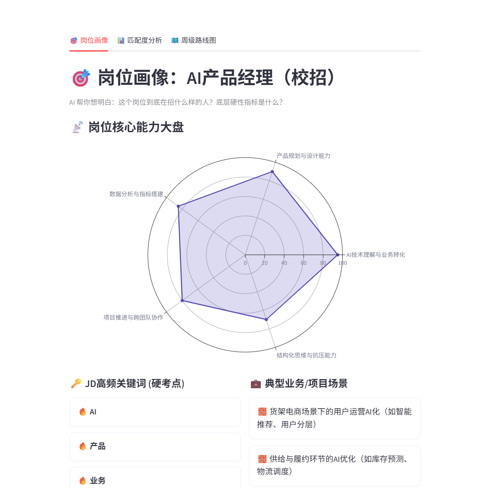
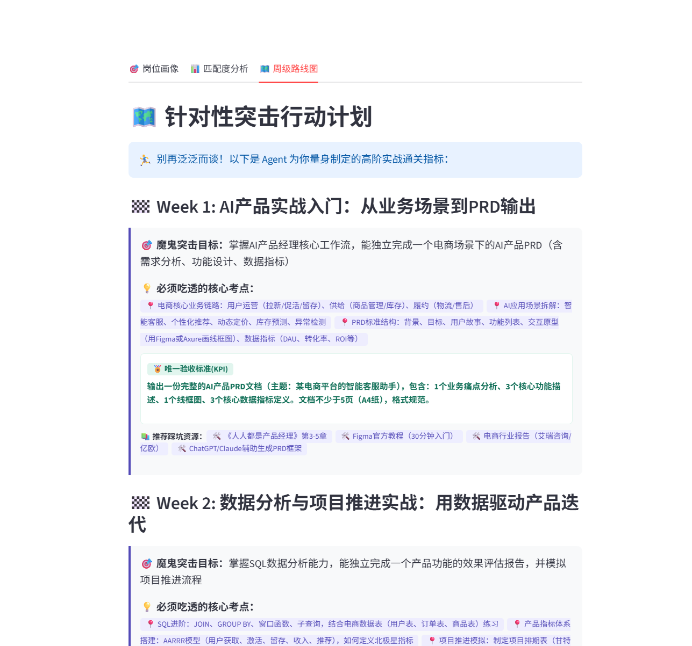

# 🧭 CareerLens · AI职业导航Agent v2.1

> 拒绝黑盒评分，拒绝鸡汤建议。输入真实JD + 你的简历，得到可执行的职业诊断报告。



**🔗 在线体验**：[careerlenss.streamlit.app](https://careerlenss.streamlit.app) —— 无需配置环境，直接打开即用

## 为什么做这个

这三个问题最初来自我自己求职时的真实体验，并非来自正式的用户研究——这是这个项目目前最大的局限，在此说明而非回避。

- **岗位定义模糊**：只输入"AI产品经理"四个字，但同名岗位在不同公司的要求差异很大，分析结果只能泛泛而谈，缺乏针对性
- **评分黑盒化**：系统直接输出72%这样的匹配度数字，但不展示计算过程，用户无法判断这个分数是否可信
- **建议鸡汤化**：给出的建议停留在"建议学习SQL"这类表述，没有说明学习深度和验收标准，用户拿到建议后不知道具体该怎么执行

这个工具的设计原则：**每一个输出都尽量做到可追溯、可质疑**。

后续做了2次用户访谈做初步验证，发现部分认知需要修正——比如"公示计算过程"并不能直接提升用户信任，真正的信任问题比"过程是否透明"更深一层；"建议要够具体"也不是越细越好，用户对"具体程度"有自己的舒适区。这些发现已经在v2.1中体现（详见 [PRD v2.1](docs/PRD_v2.1.md) 第0章复盘说明）。

## 核心功能

**看板一：岗位画像**
逆向拆解JD，提取企业真正的招聘刚需，五维雷达图可视化。

**看板二：匹配度分析**
显示加权计算公式和各维度得分明细表，呈现72%是怎么算出来的。加权分与总分均由代码计算（v2.1修订，不再依赖大模型自行计算，避免数学不一致）。

**看板三：周级行动路线图**
每条建议绑定可执行的KPI交付物（"完成15道SQL中等题"，不是"学习SQL"）。

## 技术架构

```
用户输入JD + 简历PDF
      ↓
PyPDF2 解析简历文本
      ↓
Prompt组装（Temperature=0.2锁定输出稳定性，仅要求模型给出原始得分与权重）
      ↓
DeepSeek API → 强制JSON结构输出
      ↓
代码端计算加权分与总分（v2.1新增，原因见PRD 7.1章节）
      ↓
Plotly雷达图 + 数据明细表 + KPI卡片渲染
```

异常处理：JSON解析失败时前端优雅降级，不闪退。

## 本地运行

```bash
git clone https://github.com/EllaYng/CareerLens
cd CareerLens
pip install -r requirements.txt
cp .env.example .env   # 填入你的DeepSeek API Key
streamlit run app.py
```

> 也可以直接访问 [在线版本](https://careerlenss.streamlit.app)，不需要任何本地配置。

## 产品截图

| 首页 | 岗位画像 | 匹配度分析 | 行动路线图 |
| ---- |---------|-----------|-----------|
|  |  |  |  |

## 项目文档

- [产品PRD文档 v2.1](docs/PRD_v2.1.md) —— 包含完整的产品设计逻辑，以及基于用户访谈的复盘与修订说明
- [用户访谈纪要](docs/用户访谈纪要.md) —— 2次非正式访谈的完整记录与发现

## 作者

EllaYng
[GitHub主页](https://github.com/EllaYng) | [产品PRD文档](docs/PRD_v2.1.md) | [查看完整截图](docs/screenshots/)